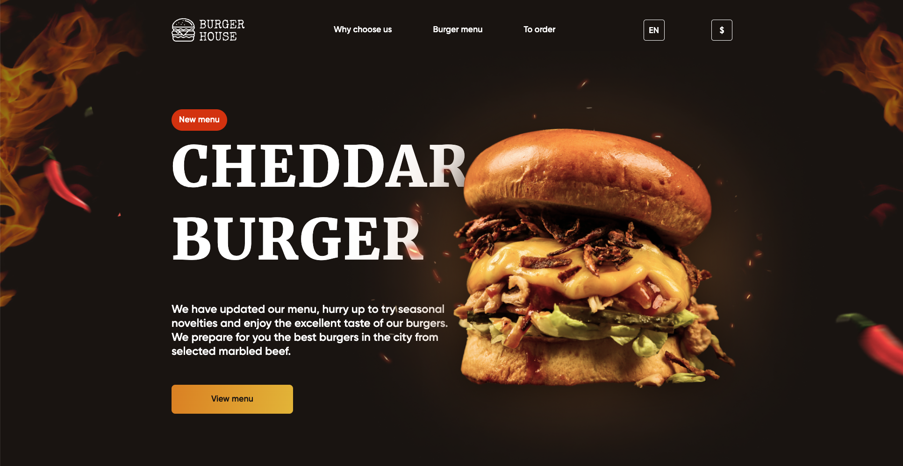

# Burger Restaurant Landing Layout

Here is a layout with beautiful and informative design. You can look and try this
on [GitHub Pages](https://andreikhromushin.github.io/BurgerRestaurantLandingLayout/index.html)

## Features

- JavaScript interactivity
- Changing language
- Changing currency
- Small form validation
- Reset scroll button

  

